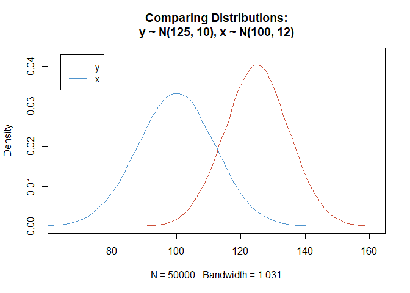

GEC Expansion Reporting
================
CNDC Analytics
Data through August 07, 2022

-   <a
    href="#1-function-to-create-normal-distributions-and-test-the-difference"
    id="toc-1-function-to-create-normal-distributions-and-test-the-difference">1
    Function to create normal distributions and test the difference</a>
-   <a href="#2-call" id="toc-2-call">2 Call</a>

# 1 Function to create normal distributions and test the difference

``` r
tTestNormalDist <- function(n = 10000, y_mu, y_sd, x_mu, x_sd, ...) {
  
  ## Create the distributions
  y = rnorm(n, y_mu, y_sd)
  x = rnorm(n, x_mu, x_sd)
  
  df <- data.frame(y,x)
  head(df)
  
  # Confidence Level 
  confLevel = 0.95

  # Plot the distributions
  
  ## Plot margins
  minX = min(y_mu, x_mu) - 3*max(x_sd)
  maxX = max(y_mu, x_mu) + 3*max(x_sd)
  maxY = max(max(density(y)$y, density(x)$y))+0.0025
  
  ## Plot Title
  plotTitle = paste0('Comparing Distributions:\n',
                     'y ~ N(',y_mu,', ',y_sd, '), x ~ N(',x_mu,', ', x_sd, ')')
  
  ## The actual Plot
  plot(density(y),  col = 'tomato3', 
       xlim = c(minX, maxX), ylim = c(0, maxY), main = plotTitle)
  lines(density(x), col = 'steelblue3')
  
  ## Add a legend to the plot
  legend(minX, maxY, legend=c("y", "x"), lty = 1,
         col=c("tomato3", "steelblue3"))
  
  # Compute the T Test  
  tTest <- t.test(y, x,conf.level = confLevel, ...)
  
  # Print the results
  print(tTest)
  print(paste('Diference should be around', y_mu-x_mu))
  print(paste('With 95% confidence, the t-test shows difference between', tTest$conf.int[1], 'and', tTest$conf.int[2]))
  
  return(list('testResults' = tTest, 
              'lowerBoundDifference' = tTest$conf.int[1], 
              'upperBoundDifference' = tTest$conf.int[2]))
}
```

# 2 Call

``` r
tTestNormalDist(n = 50000,
                y_mu = 125, y_sd = 10,
                x_mu = 100, x_sd = 12)
```

<!-- -->

    ## 
    ##  Welch Two Sample t-test
    ## 
    ## data:  y and x
    ## t = 356.26, df = 96806, p-value < 2.2e-16
    ## alternative hypothesis: true difference in means is not equal to 0
    ## 95 percent confidence interval:
    ##  24.85001 25.12494
    ## sample estimates:
    ## mean of x mean of y 
    ## 124.91651  99.92903 
    ## 
    ## [1] "Diference should be around 25"
    ## [1] "With 95% confidence, the t-test shows difference between 24.850005201532 and 25.1249440142338"

    ## $testResults
    ## 
    ##  Welch Two Sample t-test
    ## 
    ## data:  y and x
    ## t = 356.26, df = 96806, p-value < 2.2e-16
    ## alternative hypothesis: true difference in means is not equal to 0
    ## 95 percent confidence interval:
    ##  24.85001 25.12494
    ## sample estimates:
    ## mean of x mean of y 
    ## 124.91651  99.92903 
    ## 
    ## 
    ## $lowerBoundDifference
    ## [1] 24.85001
    ## 
    ## $upperBoundDifference
    ## [1] 25.12494
