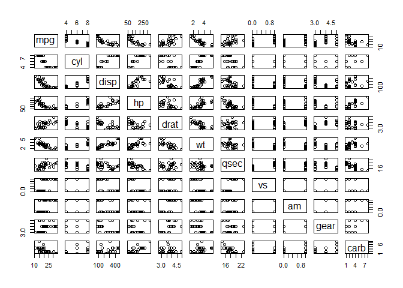

Pair Plots
================
Daniel Carpenter  
April 2022

## Suggested Function: `ggpairs()`

``` r
library(GGally) # https://r-charts.com/correlation/ggpairs/

# Basic pairs plot with ggpairs
ggpairs(iris) + theme_minimal()
```

<!-- -->

``` r
# Colored by qualitative Variable plot
ggpairs(iris,
        aes(color = Species,  # Color by group (cat. variable)
            alpha = 0.7)) + theme_minimal()
```

<!-- -->

## Other Pair Plot Functions

``` r
# gpairs with distributions 
library(gpairs)
gpairs(iris)
```

<!-- -->

``` r
# Base R Pairs 
pairs(mtcars)
```

<!-- -->
